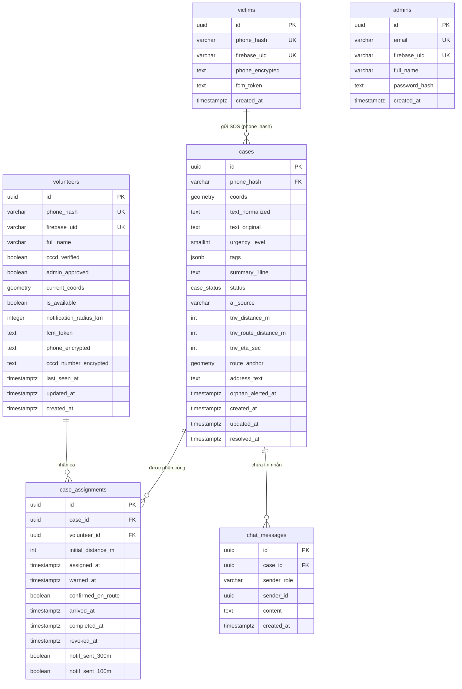

# ERD FloodAid

> Sinh từ `backend/src/db/migrations.js` — trạng thái schema **sau khi chạy hết migration 001→017**
> (đã tính đổi tên `text_raw`→`text_normalized`, đã bỏ `skills`, `flag_count`).
>
> 6 bảng: victims, volunteers, cases, case_assignments, chat_messages, admins.
> 4 khóa ngoại: cases→victims, case_assignments→cases, case_assignments→volunteers, chat_messages→cases.
> (Hai bảng từ điển phương ngữ `dialect_terms` / `dialect_meta` vẫn có trong code nhưng được lược khỏi ERD/báo cáo — xem hạn chế ở mục 5.2.)

---

## 1) DBML — dán vào https://dbdiagram.io

```dbml
Enum case_status {
  pending
  responding
  on_scene
  resolved
  cancelled
  orphaned
}

Table victims {
  id uuid [pk]
  phone_hash varchar(64) [unique, not null, note: 'HMAC-SHA256']
  firebase_uid varchar(128) [unique]
  phone_encrypted text [note: 'AES-256-GCM']
  fcm_token text
  created_at timestamptz
}

Table volunteers {
  id uuid [pk]
  phone_hash varchar(64) [unique, not null]
  firebase_uid varchar(128) [unique]
  full_name varchar(255)
  cccd_verified boolean
  admin_approved boolean
  current_coords geometry [note: 'POINT, SRID 4326']
  is_available boolean
  notification_radius_km integer [note: 'NULL=nhận tất cả, 0=tắt, n=bán kính km']
  fcm_token text
  phone_encrypted text
  cccd_number_encrypted text
  last_seen_at timestamptz
  updated_at timestamptz
  created_at timestamptz
}

Table cases {
  id uuid [pk]
  phone_hash varchar(64) [not null]
  coords geometry [not null, note: 'POINT, SRID 4326']
  text_normalized text [note: 'đã chuẩn hóa phương ngữ']
  text_original text [note: 'bản gốc trước chuẩn hóa']
  urgency_level smallint [not null, note: 'CHECK 1..5']
  tags jsonb
  summary_1line text [not null]
  status case_status
  ai_source varchar(20) [note: 'CHECK gemini|regex|rule_based']
  tnv_distance_m int [note: 'đường chim bay']
  tnv_route_distance_m int [note: 'quãng đường thật (VietMap)']
  tnv_eta_sec int
  route_anchor geometry [note: 'POINT, SRID 4326']
  route_updated_at timestamptz
  address_text text
  orphan_alerted_at timestamptz
  created_at timestamptz
  updated_at timestamptz
  resolved_at timestamptz
}

Table case_assignments {
  id uuid [pk]
  case_id uuid [not null]
  volunteer_id uuid [not null]
  initial_distance_m int
  assigned_at timestamptz
  warned_at timestamptz
  confirmed_en_route boolean
  arrived_at timestamptz
  completed_at timestamptz
  revoked_at timestamptz
  notif_sent_300m boolean
  notif_sent_100m boolean
  indexes {
    (case_id, volunteer_id) [unique]
  }
}

Table chat_messages {
  id uuid [pk]
  case_id uuid [not null]
  sender_role varchar(10) [note: 'CHECK volunteer|victim']
  sender_id uuid
  content text [not null]
  created_at timestamptz
}

Table admins {
  id uuid [pk]
  email varchar(255) [unique, not null]
  firebase_uid varchar(128) [unique]
  full_name varchar(255)
  password_hash text [note: 'bcrypt']
  created_at timestamptz
}

Ref: cases.phone_hash > victims.phone_hash
Ref: case_assignments.case_id > cases.id
Ref: case_assignments.volunteer_id > volunteers.id
Ref: chat_messages.case_id > cases.id
```

---

## 2) Mermaid — dán vào https://mermaid.live (hoặc xem trực tiếp trong VS Code)



---

## Ghi chú cho báo cáo

- **victims** và **volunteers** đều có `phone_hash` nhưng **không có FK nối trực tiếp** với nhau; chỉ `cases.phone_hash` tham chiếu `victims.phone_hash`.
- **admins** là bảng độc lập (không FK) — không gắn khóa ngoại vào luồng ca SOS.
- `chat_messages.case_id` có **ON DELETE CASCADE** (xóa ca thì tin nhắn tự xóa) — dbdiagram/mermaid không thể hiện cascade, nếu cần bạn ghi chú thêm trong báo cáo.
- Cột kiểu `geometry` (`coords`, `current_coords`, `route_anchor`) là PostGIS `GEOMETRY(POINT, 4326)`.
